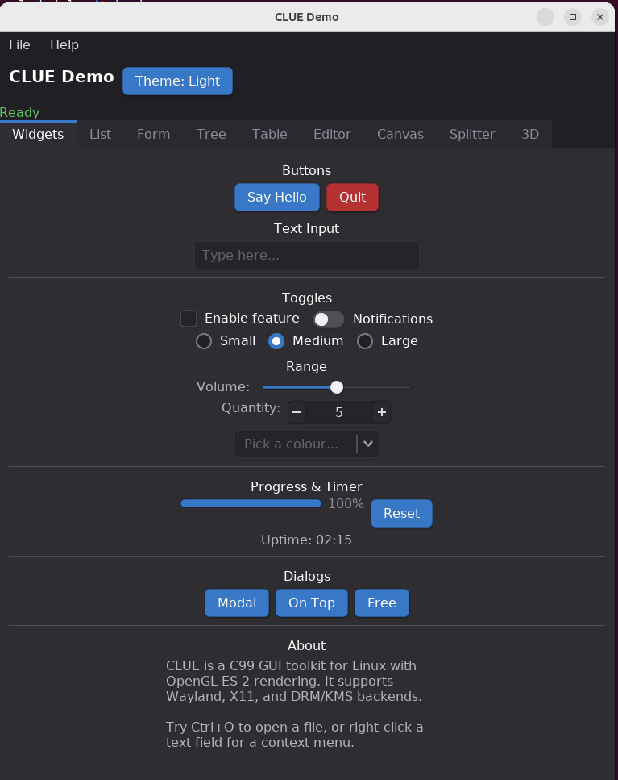
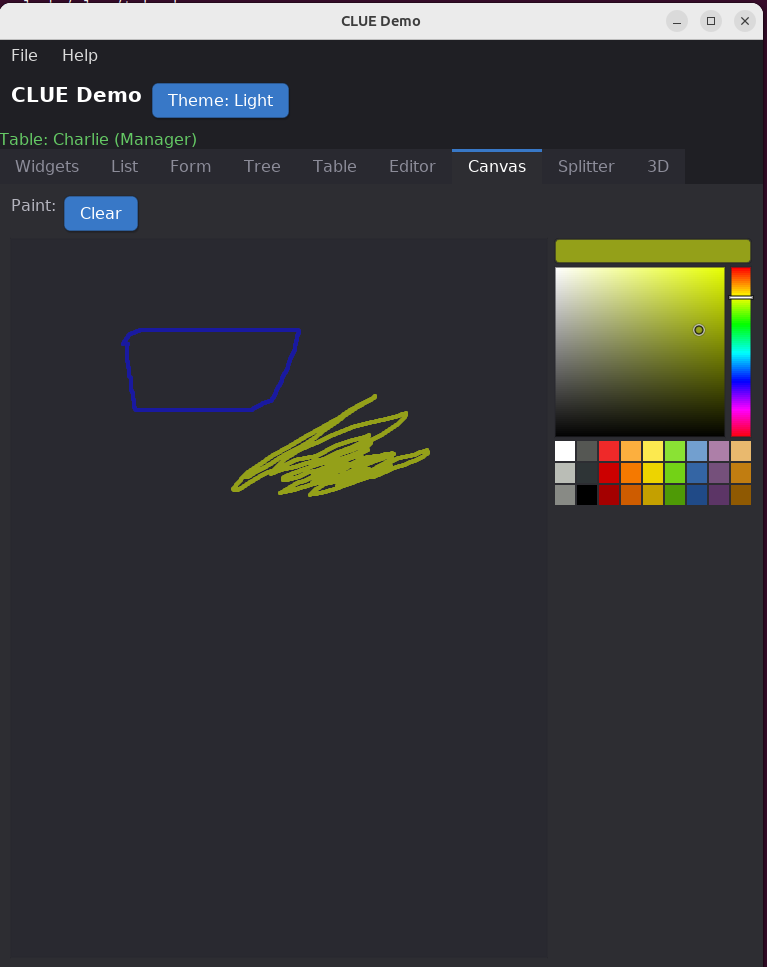
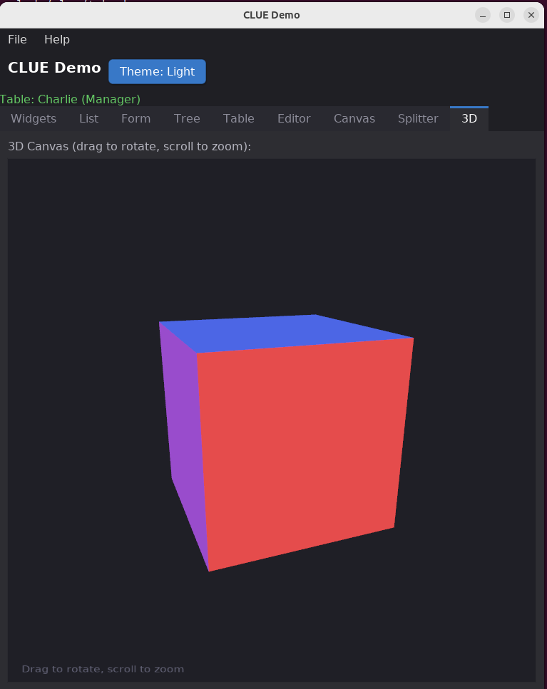
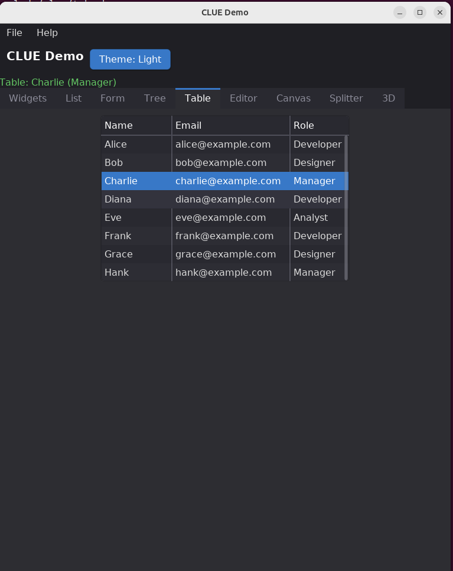
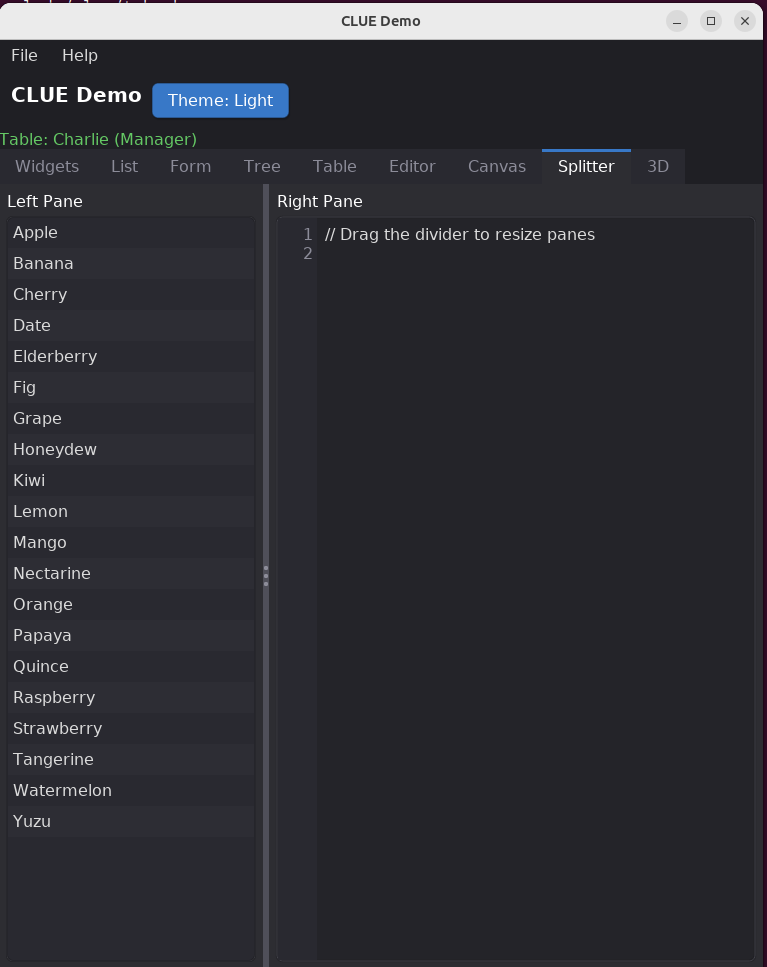
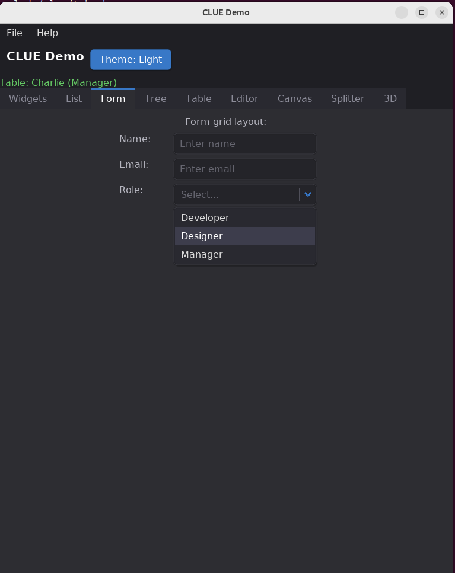

# CLUE — C Lightweight UI Engine

A lightweight C99 GUI toolkit for Linux with OpenGL ES 2 rendering and multiple display backends (Wayland, X11, DRM/KMS).

> **Note:** Currently tested on X11 only. Wayland and DRM backends compile but are untested.

## Screenshots

| Widgets | Canvas | 3D |
|---------|--------|----|
|  |  |  |

| Table | Splitter | Form |
|-------|----------|------|
|  |  |  |

## Features

- **Widgets**: buttons, labels, text inputs, checkboxes, radio buttons, sliders, dropdowns, progress bars, toggle switches, spinboxes, separators, images
- **Containers**: boxes, grids, tabs, scroll, splitter, toolbar, statusbar
- **Data views**: list views, tables, tree views
- **Advanced**: multi-line text editor, canvas, color picker, file dialogs, menus, tooltips, dialogs
- **Text editing**: selection, copy/cut/paste, clipboard (system + internal)
- **Keyboard shortcuts**: user-registered global keybindings
- **Mouse cursors**: resize, text, crosshair, pointer (X11 + Wayland)
- **Backends**: Wayland, X11, DRM/KMS
- **Theming**: built-in dark/light themes with full customization
- **Signals**: GTK-style signal/callback system
- **Timers**: repeating and one-shot timers
- **Font rendering**: FreeType-based text rendering
- **Type safety**: C11 `_Generic` auto-cast macros for widget APIs
- **Zero dependencies beyond system libs**: EGL, GLES2, FreeType, xkbcommon

## Getting started

### Install dependencies

```bash
./build.sh --install-deps
```

### Build

```bash
./build.sh
```

Options:
- `--wayland-only` — build only the Wayland backend
- `--x11-only` — build only the X11 backend
- `--drm-only` — build only the DRM/KMS backend
- `--no-wayland`, `--no-x11`, `--no-drm` — disable individual backends
- `--install` — install library and build demo
- `--clean` — clean rebuild
- `-j N` — parallel jobs

Flags can be combined:

```bash
./build.sh --clean --x11-only --install
```

### Install

```bash
./build.sh --install
```

This installs:
- `libclue.a` to `/usr/local/lib/`
- Headers to `/usr/local/include/clue/`
- `clue.pc` to `/usr/local/lib/pkgconfig/`
- Demo sources to `/usr/local/share/clue/examples/demo/`

### Run the demo

After installing, the demo is built automatically. You can also rebuild it:

```bash
cd /usr/local/share/clue/examples/demo
make
./clue_demo
```

## Quick start

```c
#include <clue/clue.h>

static void on_clicked(void *widget, void *data)
{
    (void)widget;
    ClueLabel *label = data;
    clue_label_set_text(label, "Button clicked!");
}

int main(void)
{
    ClueApp *app = clue_app_new("My App", 400, 300);
    if (!app) return 1;

    ClueBox *vbox = clue_box_new(CLUE_VERTICAL, 12);
    clue_style_set_padding(&vbox->base.style, 20);

    ClueLabel *label = clue_label_new("Hello, CLUE!");
    ClueButton *btn = clue_button_new("Click Me");
    clue_signal_connect(btn, "clicked", on_clicked, label);

    clue_container_add(vbox, label);
    clue_container_add(vbox, btn);

    clue_app_set_root(app, vbox);
    clue_app_run(app);
    clue_app_destroy(app);
    return 0;
}
```

### Compile your own project

Link against the installed library with pkg-config:

```bash
cc main.c $(pkg-config --cflags --libs clue) -o myapp
```

## Documentation

Full API reference: [docs/index.html](docs/index.html)

## License

[MIT](LICENSE)
